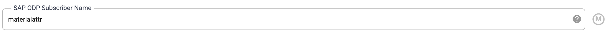

# SCM Digital Twin Data Integration in Cloud Data Fusion

# Version

Version 1.0
 
# L0 Layer Delta Load
# Overview

In SAP all extartor are not set for delta load. Only few extractors are having the delta option enable. Due to this we are creating delta process for few extarctors. Below are the list of extractors which support the delta.

  
  ## List of extractors used to get the delta data from SAP to the raw layer.

| EXTRACTOR NAME       | DESCRIPTION                               |
|----------------------|-------------------------------------------|
| 0ASSET_ATTR_TEXT     | Subnumber with Description                |
| 0CO_PC_ACT_05        | Material Valuation Record Prices          |
| 0COMP_CODE_ADDRESS   | Company Code Details                      |
| 0COMP_CODE_ATTR      | Company code                              |
| 0COMP_CODE_TEXT      | Company Code                              |
| 0CUST_COMPC_ATTR     | Customer                                  |
| 0CUST_SALES_ATTR     | Customer                                  |
| 0CUSTOMER_ATTR       | Customer                                  |
| 0FI_GL_4             | Gen. Ledger: Items Delta Extraction       |
| 0MAT_PLANT_ATTR      | Material                                  |
| 0MAT_ST_LOC_ATTR     | Material                                  |
| 0MATERIAL_ATTR       | Material                                  |
| 0MATERIAL_TEXT       | Material text                             |
| 0PLANT_ATTR          | Plant                                     |
| 0VENDOR_ATTR         | Vendor                                    |
| 2LIS_02_HDR          | Purchasing Data (Header Level)            |
| 2LIS_02_ITM          | Purchasing Data (Item Level)              |
| 2LIS_04_P_MATNR      | Material View from PP/PP-PI               |
| 2LIS_06_INV          | Invoice Verification Data                 |
| 2LIS_11_VAHDR        | Sales Document Header                     |
| 2LIS_11_VAITM        | Sales Document Item                       |
| 2LIS_11_VASCL        | Sales Document Schedule Line              |
| 2LIS_12_VCHDR        | Delivery Header Data                      |
| 2LIS_12_VCITM        | Delivery Item Data                        |
| 2LIS_12_VCSCL        | Schedule Line Delivery                    |
| 2LIS_13_VDHDR        | Billing Doc. Header Data                  |
| 2LIS_13_VDITM        | Billing Document Item Data                |
  
 ## Delta Load pipeline 
 

## Data Source SAP ODP Plugin options.  

**Below are the 3 options which are main in the SAP ODP plugin which we have to set for the full load.**

SAP ODP Plugin Version: 0.0.12

**SAP ODP Datasource Name** - Need to pass the extractor name from which we need to extractor the data.

**Extract Type** - Mode to extract Sync which makes the OPD Plugin to get the delta data which got recently update/insert.

**SAP ODP Subscriber Name** - In this we are going to pass a name which is getting register in SAP that with Subscriber Name we have done Full or Sync load.

> Note: We have pass unique name to ODP Subscriber for each extractor.
  
In Delta Load we us the Target table as source and target, as we are implementing the SCD Type 2 for all the raw table. As we use main table as source we have to select on valid records. 

Below are list of option which we need to take care in the pipeline.

**Source Big Query Table Filter** -- This option is set to select only the valid records, which are compared with source records comming from the extractor to implement SCD type 2.

**Target Big Query Tabel Option** -- In SCD Type 2, when a new records we have to insert the record and for old records if there is a match then we have to invalid the old record and insert the new record.

**Truncate Option**. -- We have turn off truncate table option in the delta load for the target Big Query Plugin. Also we have to see that we are inserting the new records and select the insert option.

**Update the Old Records in Big Query** -- As in SCD type 2 we have to turn invalid the old records which has a match with the delta data.For this we have to dedupe for this below are the option we have to give and update the record no the key column.

Copyright 2021 Google Inc. All rights reserved.

The use of this software is governed by the Pre-GA Offering Terms section of the the Service Specific Terms set forth at
https://cloud.google.com/terms/service-terms#general-service-terms

