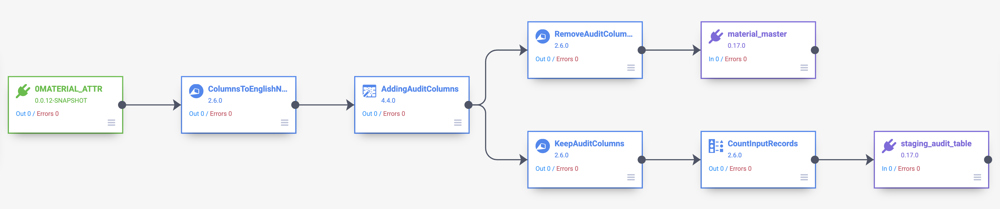
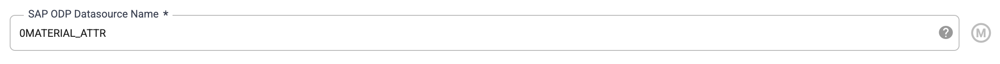
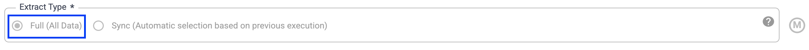
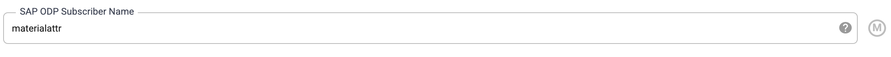
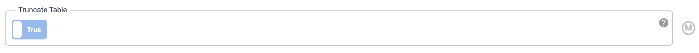

# SCM Digital Twin Data Integration in Cloud Data Fusion

# Version

Version 1.0
 
# L0 Layer  Full Load
# Overview

Data pipeline are developed to extract the data from the SAP using the ODP Plugin and load the data into Big Query. SAP extarctors has ability to get the data in full and delta mode. Hence, the ODP plugin has an option to say are we doing full or delta load.
  
  
  ## List of extractors used to get the data from SAP to the raw layer.

| EXTRACTOR NAME       | DESCRIPTION                               |
|----------------------|-------------------------------------------|
| 0ASSET_ATTR_TEXT     | Subnumber with Description                |
| 0BP_DEF_ADDRESS_ATTR | SAP BP: BP Standard Address Extraction    |
| 0CO_PC_ACT_05        | Material Valuation Record Prices          |
| 0COMP_CODE_ADDRESS   | Company Code Details                      |
| 0COMP_CODE_ATTR      | Company code                              |
| 0COMP_CODE_TEXT      | Company Code                              |
| 0CUST_COMPC_ATTR     | Customer                                  |
| 0CUST_SALES_ATTR     | Customer                                  |
| 0CUSTOMER_ATTR       | Customer                                  |
| 0FI_GL_4             | Gen. Ledger: Items Delta Extraction       |
| 0MAT_PLANT_ATTR      | Material                                  |
| 0MAT_ST_LOC_ATTR     | Material                                  |
| 0MATERIAL_ATTR       | Material                                  |
| 0MATERIAL_TEXT       | Material text                             |
| 0PLANT_ATTR          | Plant                                     |
| 0PP_MD_MATERIAL      | Datasource for Material tab               |
| 0PROD_HIER_TEXT      | Prod.hierarchy                            |
| 0PRODORDER_ATTR      | Prod. order                               |
| 0RT_VALAREA_ATTR     | Valuation area                            |
| 0VEN_PURORG_ATTR     | Vendor                                    |
| 0VENDOR_ATTR         | Vendor                                    |
| 2LIS_03_BF           | Goods Movements From Inventory Management |
| 2LIS_02_HDR          | Purchasing Data (Header Level)            |
| 2LIS_02_ITM          | Purchasing Data (Item Level)              |
| 2LIS_03_BX           | Stock Initialization for Inventory Management   |
| 2LIS_04_P_MATNR      | Material View from PP/PP-PI               |
| 2LIS_06_INV          | Invoice Verification Data                 |
| 2LIS_11_VAHDR        | Sales Document Header                     |
| 2LIS_11_VAITM        | Sales Document Item                       |
| 2LIS_11_VASCL        | Sales Document Schedule Line              |
| 2LIS_11_VASTH        | Order Header Status                       |
| 2LIS_11_VASTI        | Order Item Status                         |
| 2LIS_12_VCHDR        | Delivery Header Data                      |
| 2LIS_12_VCITM        | Delivery Item Data                        |
| 2LIS_12_VCSCL        | Schedule Line Delivery                    |
| 2LIS_13_VDHDR        | Billing Doc. Header Data                  |
| 2LIS_13_VDITM        | Billing Document Item Data                |
  
 ## Full Load pipeline 
 

## Data Source SAP ODP Plugin options.  

SAP ODP Plugin version : 0.0.12

**Below are the 3 options which are main in the SAP ODP plugin which we have to set for the full load.**  

**SAP ODP Datasource Name** - Need to pass the extractor name from which we need to extractor the data.

**Extract Type** - Mode to extract (Full or Sync)

**SAP ODP Subscriber Name** - In this we are going to pass a name which is getting register in SAP that with Subscriber Name we have done Full or Sync load.

> Note: We have to pass unique name in ODP Sucscriber for each extractor.
  
Target Big Query Table plugin we turn on the below option. 

> Note: When we run the full load pipeline this option will truncate the table and loads the fresh data.

Copyright 2021 Google Inc. All rights reserved.

The use of this software is governed by the Pre-GA Offering Terms section
of the the Service Specific Terms set forth at
https://cloud.google.com/terms/service-terms#general-service-terms
